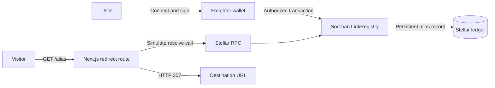

# Blink

Wallet-owned short links powered by Stellar and Soroban.

Blink turns a short-link alias into a portable on-chain record. The alias owner is a Stellar address rather than an account in a private database, so ownership can be verified publicly and destinations can be updated without replacing the short link.

> **Project status:** MVP under active development. The application currently targets Stellar Testnet and is not production-ready.

## Why Blink?

Traditional URL shorteners control both the alias and its routing data. If the service closes an account, changes its policies, or disappears, the user can lose the public link they distributed.

Blink separates the system into two layers:

- **Ownership and routing authority live on-chain.** A Soroban contract records the alias owner, destination, status, and timestamps.
- **Redirect delivery stays in the web layer.** Next.js reads the contract through Stellar RPC and performs a standard HTTP redirect.

This keeps redirects simple while making control of the alias independently verifiable.

## Features

- Create a unique alias using a Stellar wallet
- Prove alias ownership through Soroban authorization
- Resolve active aliases without authentication
- Update a destination while preserving the public short link
- Deactivate an alias without deleting its ownership record
- Emit indexable events for create, update, and deactivate operations
- Extend persistent-storage TTL when records are used
- Sign transactions from the browser with Freighter
- Redirect requests from `/{alias}` through the Next.js application
- Responsive landing page and link creation experience

## How it works



### Link record

Each alias maps to the following Soroban value:

```rust
pub struct Link {
    pub owner: Address,
    pub destination: String,
    pub active: bool,
    pub created_at: u64,
    pub updated_at: u64,
}
```

Aliases are stored in Soroban persistent storage. The contract currently accepts aliases between 3 and 32 characters and destinations up to 2,048 characters. The web client applies additional alias and HTTP/HTTPS URL validation before creating a transaction.

## Technology stack

| Layer | Technology | Responsibility |
|---|---|---|
| Web application | Next.js 16, React 19, TypeScript | Interface and redirect delivery |
| Wallet | Freighter API | Wallet access and transaction signing |
| Stellar client | Stellar JavaScript SDK | RPC calls, simulation, XDR, and submission |
| Smart contract | Rust, Soroban SDK | Ownership, authorization, and link state |
| Network | Stellar Testnet | Current development environment |

## Repository structure

```text
.
├── app/
│   ├── [alias]/route.ts       # Alias resolution and HTTP redirect
│   ├── globals.css            # Application theme
│   ├── layout.tsx             # Root layout and metadata
│   └── page.tsx               # Landing page
├── components/
│   └── create-link-form.tsx   # Freighter-backed creation flow
├── contracts/
│   └── link-registry/
│       ├── src/lib.rs         # Soroban contract
│       └── src/test.rs        # Contract unit tests
├── lib/
│   └── stellar.ts             # RPC and transaction helpers
├── .env.example
├── Cargo.toml                 # Rust workspace
└── package.json
```

## Prerequisites

Install the following before running the project:

- Node.js 22 or newer
- npm
- Rust 1.91 or newer
- Stellar CLI 26 or a compatible release
- Freighter browser extension
- A funded Stellar Testnet account

Confirm the local tools:

```bash
node --version
npm --version
rustc --version
stellar --version
```

## Local setup

### 1. Install dependencies

```bash
npm install
```

### 2. Configure the environment

Create a local environment file:

```bash
cp .env.example .env.local
```

Available variables:

| Variable | Description | Example |
|---|---|---|
| `NEXT_PUBLIC_STELLAR_NETWORK` | Intended Stellar environment | `testnet` |
| `NEXT_PUBLIC_STELLAR_RPC_URL` | Stellar RPC endpoint | `https://soroban-testnet.stellar.org` |
| `NEXT_PUBLIC_CONTRACT_ID` | Deployed LinkRegistry contract address | `C...` |
| `NEXT_PUBLIC_APP_ORIGIN` | Public application origin used in link previews | `http://localhost:3000` |

The current client implementation uses the Stellar Testnet passphrase. Changing only `NEXT_PUBLIC_STELLAR_NETWORK` does not make the application Mainnet-ready.

### 3. Run the web application

```bash
npm run dev
```

Open [http://localhost:3000](http://localhost:3000).

The landing page works without a contract ID, but creating and resolving real aliases requires a deployed contract.

## Smart contract

### Contract methods

| Method | Authorization | Result | Description |
|---|---|---|---|
| `create(owner, alias, destination)` | Owner required | `Link` | Creates a unique active alias |
| `resolve(alias)` | Public | `Option<Link>` | Returns an active link or `None` |
| `update(owner, alias, destination)` | Owner required | `Link` | Replaces the destination and reactivates the link |
| `deactivate(owner, alias)` | Owner required | `()` | Marks the link inactive |

### Contract errors

| Code | Error | Meaning |
|---:|---|---|
| `1` | `InvalidAlias` | Alias length is outside the accepted range |
| `2` | `InvalidDestination` | Destination is empty or longer than 2,048 characters |
| `3` | `AliasTaken` | A persistent record already exists for the alias |
| `4` | `LinkNotFound` | The alias does not exist or is not owned by the supplied address |

### Events

All lifecycle changes emit a `LinkEvent` with:

- Fixed topic: `link`
- Indexed topics: action and owner
- Data: alias

Supported actions are `created`, `updated`, and `disabled`.

## Test and build

Run the contract tests:

```bash
npm run test:contract
```

Run frontend checks:

```bash
npm run lint
npm run build
```

Build the deployable contract Wasm:

```bash
stellar contract build
```

The generated artifact is written to:

```text
target/wasm32v1-none/release/link_registry.wasm
```

## Deploy to Stellar Testnet

### 1. Configure a Stellar identity

Use an existing local identity or generate a new one:

```bash
stellar keys generate blink-deployer --network testnet --fund
```

Never commit secret keys or seed phrases to this repository.

### 2. Build the contract

```bash
stellar contract build
```

### 3. Deploy

```bash
stellar contract deploy \
  --wasm target/wasm32v1-none/release/link_registry.wasm \
  --source blink-deployer \
  --network testnet
```

The command returns a contract ID beginning with `C`. Add it to `.env.local`:

```dotenv
NEXT_PUBLIC_CONTRACT_ID=C...
```

Restart the development server after changing public environment variables.

## User flow

1. Enter an alias and destination URL.
2. Connect or authorize the Freighter wallet.
3. Review and sign the simulated Soroban transaction.
4. Wait for the transaction to be confirmed through Stellar RPC.
5. Visit `NEXT_PUBLIC_APP_ORIGIN/{alias}`.
6. The server resolves the alias and returns an HTTP `307` redirect.

## Security considerations

This repository is an MVP and has not received a professional security audit.

- Contract mutations require authorization from the stored owner.
- The redirect layer should continue to allow only intended URL schemes.
- Destination validation is stricter in the frontend than in the contract; direct contract callers can currently store any non-empty string within the size limit.
- Public redirect services must consider phishing, malware, abuse reporting, and domain-blocking policies.
- Persistent storage requires TTL management and may eventually need restoration or maintenance tooling.
- Mainnet deployment requires dedicated RPC infrastructure, monitoring, rate limiting, contract review, and an explicit network configuration refactor.
- Do not place private keys or privileged credentials in `NEXT_PUBLIC_*` variables; they are exposed to the browser bundle.

## Current limitations

- The interface creates links but does not yet expose update or deactivate controls.
- There is no owner dashboard or alias search.
- Only one configured contract is supported.
- The client is currently hard-wired to the Testnet network passphrase.
- Redirect resolution depends on the configured RPC endpoint.
- There are no analytics, custom domains, abuse controls, or premium aliases.
- Ownership transfer is not implemented.

## Roadmap

### Product

- Owner dashboard for managing aliases
- Update, deactivate, and reactivate actions in the UI
- Availability checks before transaction creation
- Custom domains and branded redirect pages
- Privacy-aware click analytics
- Premium aliases and Stellar asset payments

### Protocol

- Explicit ownership transfer
- Alias normalization enforced by the contract
- Stronger destination scheme validation
- Configurable renewal and storage-maintenance model
- Generated TypeScript contract bindings
- Mainnet configuration and deployment workflow

### Operations

- Abuse reporting and moderation tooling
- RPC health monitoring and fallback providers
- End-to-end redirect tests
- Continuous integration for Rust and TypeScript checks
- Independent Soroban contract audit

## Contributing

Issues and pull requests are welcome. Before submitting a change:

```bash
npm run lint
npm run build
npm run test:contract
```

Keep contract behavior, frontend validation, documentation, and tests synchronized when changing the link model or contract API.

## Useful resources

- [Stellar developer documentation](https://developers.stellar.org/)
- [Soroban smart contracts](https://developers.stellar.org/docs/build/smart-contracts/overview)
- [Stellar JavaScript SDK](https://github.com/stellar/js-stellar-sdk)
- [Freighter wallet](https://www.freighter.app/)

## License

No license has been selected yet. Until a license file is added, all rights are reserved by the repository owner.
